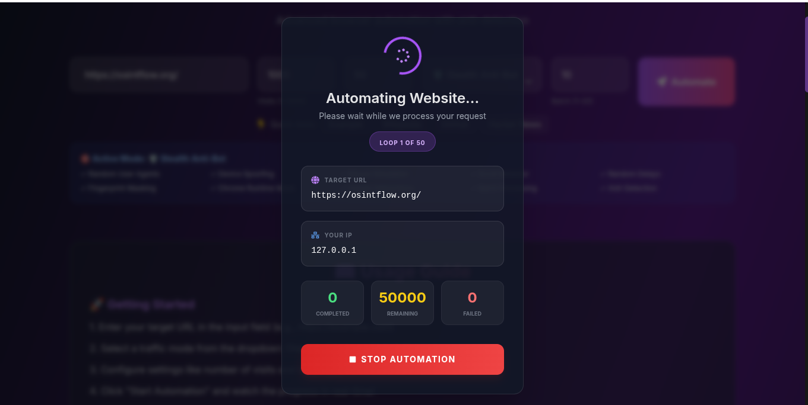
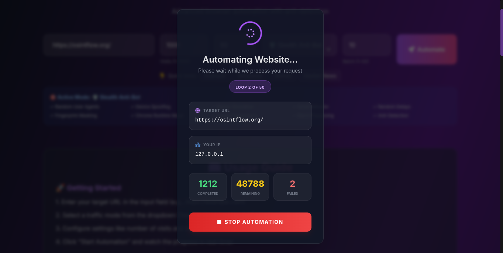
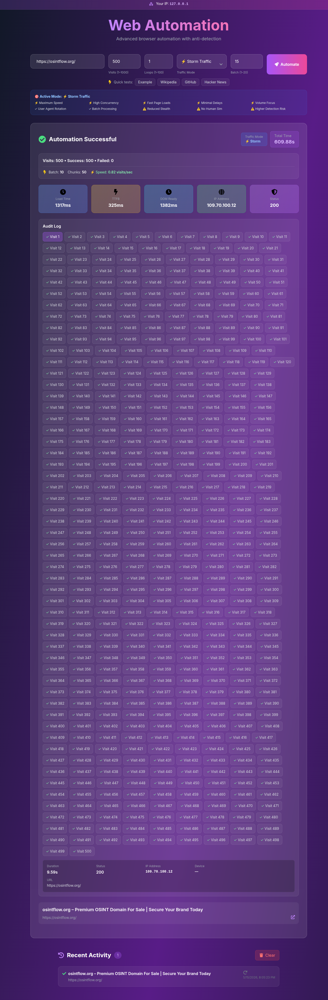
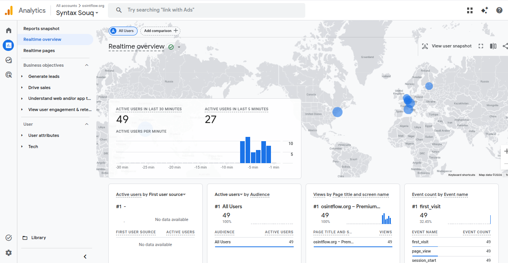
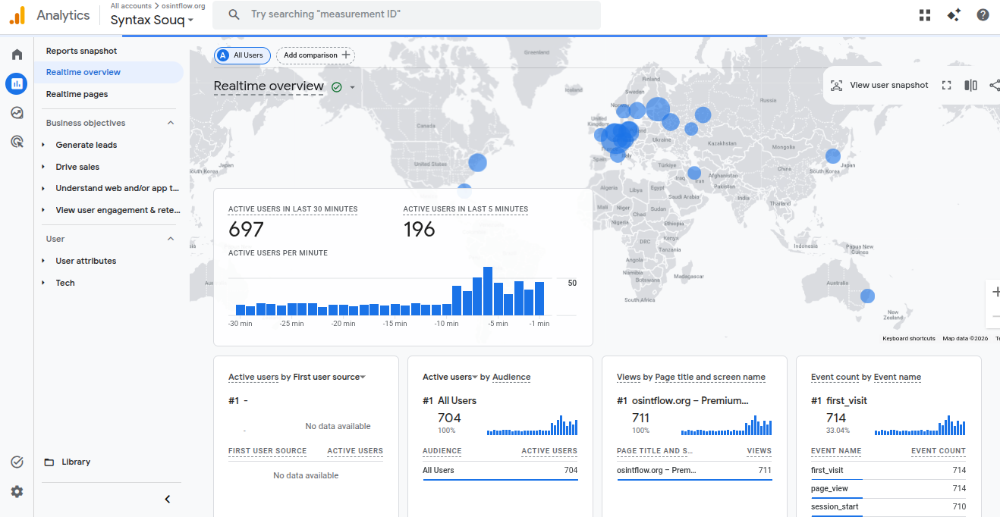

# 🚀 Web Traffic Lab: Advanced Browser Automation Platform

Web Traffic Lab is a sophisticated, production-ready browser automation engine designed to simulate high-fidelity human browsing behavior. Whether you need to test site performance under load, verify analytics integration, or simulate complex search engine referral patterns, Web Traffic Lab provides a secure and scalable environment for all your traffic automation needs.

---

## 📸 Project Showcase

The platform features a modern, intuitive dashboard that provides real-time visibility into every automation cycle.

| Step | Description | Visual |
| :--- | :--- | :--- |
| **1. Configuration** | Custom URL, traffic mode, and visit parameters. |  |
| **2. Live Execution** | Real-time SSE updates and loop progress. |  |
| **3. Result Summary** | Comprehensive analytics and performance logs. |  |
| **4. Real-time Impact** | Immediate visibility in GA4 Real-time dashboard. |  |
| **5. High-Scale Load** | Sustaining hundreds of active concurrent sessions. |  |

---

## 🌟 Core Functionality

### 🤖 Intelligent Traffic Simulation
- **Human-Like Interaction**: Emulates mouse movements, scrolling patterns, and natural click behavior to bypass basic heuristic detection.
- **Anti-Detection Engineering**: Leverages Playwright Stealth to minimize browser fingerprinting and appear as a genuine user.
- **Referrer Spoofing**: Simulates organic traffic origins from major search engines and social platforms.

### ⚡ Performance & Scalability
- **Storm Mode**: Optimized for high-volume concurrency to test infrastructure limits.
- **Batch Processing**: Intelligent visit queuing to manage system resources effectively.
- **Live Monitoring**: Server-Sent Events (SSE) provide a zero-latency feedback loop between the backend engine and the user interface.

### 🛡️ Enterprise-Grade Security
- **SSRF Protection**: Built-in validation to prevent the automation engine from accessing internal or restricted network resources.
- **Browser Isolation**: Each session runs in a clean, isolated environment to ensure data privacy and prevent cross-session contamination.
- **Rate Safeguards**: Configurable limits to ensure responsible usage and prevent accidental abuse.

---

## 🛠️ Technical Ecosystem

### Frontend
- **Framework**: [React](https://reactjs.org/) + [Vite](https://vitejs.dev/)
- **Styling**: [Tailwind CSS](https://tailwindcss.com/)
- **State Management**: React Hooks & Context API
- **UI Components**: Custom-built responsive dashboard

### Backend
- **Runtime**: [Node.js](https://nodejs.org/)
- **Server**: [Express](https://expressjs.com/)
- **Automation Engine**: [Playwright](https://playwright.dev/) with Stealth & Ad-blocker plugins
- **Communication**: Server-Sent Events (SSE) for real-time streaming

---

## 🚀 Getting Started

### 1. Prerequisites
- **Node.js**: `v18+`
- **npm**: `v10+`

### 2. Installation
Clone the repository and install dependencies for both backend and frontend:
```bash
# Root dependencies
npm install

# Frontend dependencies
cd frontend && npm install && cd ..
```

### 3. Environment Setup
Install the necessary Playwright browser binaries:
```bash
npx playwright install chromium
```

### 4. Launch Development
```bash
npm run dev
```
- **Dashboard**: `http://localhost:5176`
- **API Engine**: `http://localhost:3006`

---

## 🧪 Use Cases
- **SEO & Referral Testing**: Verify that your site correctly attributes traffic from various search engine referrers.
- **Analytics Validation**: Ensure Google Analytics (GA4) and other tracking scripts are firing correctly under different browsing conditions.
- **Performance Benchmarking**: Stress test your web server and CDN performance with simulated concurrent traffic.
- **UI/UX Stability**: Automate repetitive navigation paths to ensure frontend stability across updates.

---

## 🛡️ Responsible Usage
Web Traffic Lab is designed for **testing and development purposes only**. Users are responsible for ensuring their automation activities comply with the Terms of Service of the target websites and all applicable laws.

---

## 📄 License
Distributed under the **MIT License**. See `LICENSE` for more information.
